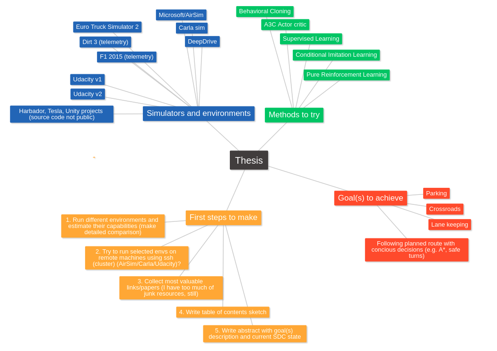

# self-driving-car-stories
This is my secret notebook which helps me to track my progress on writing SDC, AI-related master's thesis.

# Mind map




Visualization: https://tobloef.com/text2mindmap/
```
Thesis
	Simulators and environments
		Udacity v1
		Udacity v2
		Carla sim
		Microsoft/AirSim
		DeepDrive
		F1 2015 (telemetry)
		Dirt 3 (telemetry)
		Euro Truck Simulator 2
		Harbador, Tesla, Unity projects (source code not public)
	Methods to try
		Behavioral Cloning
		A3C Actor critic
		Supervised Learning
		Conditional Imitation Learning
		Pure Reinforcement Learning
	Goal(s) to achieve
		Lane keeping
		Parking
		Crossroads
		Following planned route with concious decisions (e.g. A*, safe turns)
		
	First steps to make
		1. Run different environments and estimate their capabilities (make detailed comparison)
		2. Try to run selected envs on remote machines using ssh (cluster) (AirSim/Carla/Udacity)?
		3. Collect most valuable links/papers (I have too much of junk resources, still)
		4. Write table of contents sketch
		5. Write abstract with goal(s) description and current SDC state
```
		
		
		
		
	
	

# Setup
